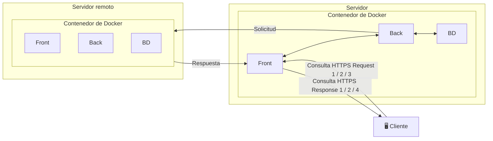
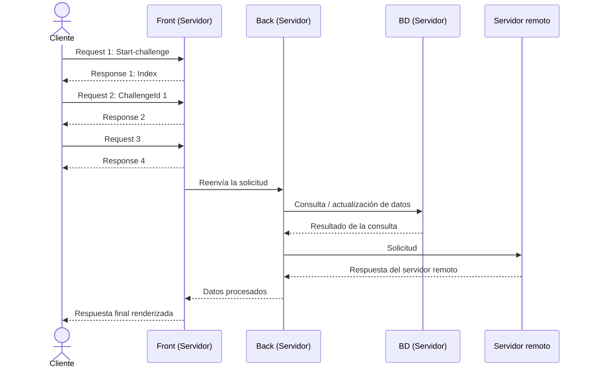

Diagrama de flujo: Cliente → Servidor → Base de Datos → Servidor Remoto
Diagrama de flujo que muestra paso a paso cómo viaja un dato desde que el usuario interactúa con la interfaz web (Frontend), pasa por el procesamiento del servidor (Backend) y termina interactuando con la Base de Datos, incluyendo la comunicación con un servidor remoto.
> Convertido desde `Diagrama_de_flujo.drawio` a Mermaid, compatible con la vista de Markdown de GitHub (no requiere plugins externos).
1. Arquitectura general (contenedores Docker)

2. Secuencia de la petición (paso a paso)

3. Referencia de mensajes (leyenda)
Paso	Mensaje	Descripción
1	Request 1	Start-challenge — el cliente inicia el reto/solicitud contra el Front.
1	Response 1	Index — el servidor responde con la página/índice inicial.
2	Request 2	ChallengeId: 1 — el cliente envía el identificador del reto.
2	Response 2	Respuesta asociada al Request 2.
3	Request 3 / Response 4	Intercambio adicional entre Cliente y Front.
4	Solicitud HTTPS o Consulta SQL	Comunicación interna Back ↔ BD y Back ↔ Servidor remoto.
---
Notas de la conversión
Los colores originales del `.drawio` (azul, naranja, verde) se agruparon aquí por tipo de flujo: azul/naranja = tráfico Cliente ↔ Front, verde = tráfico Back ↔ BD / Servidor remoto.
Ambos diagramas usan sintaxis Mermaid, que GitHub renderiza de forma nativa dentro de archivos `.md` (sin necesidad de imágenes exportadas ni plugins).
Si necesitas editar la disposición visual (posiciones exactas, colores exactos), lo ideal es mantener el `.drawio` como fuente y este `.md` como versión "documentada" para el repositorio.
